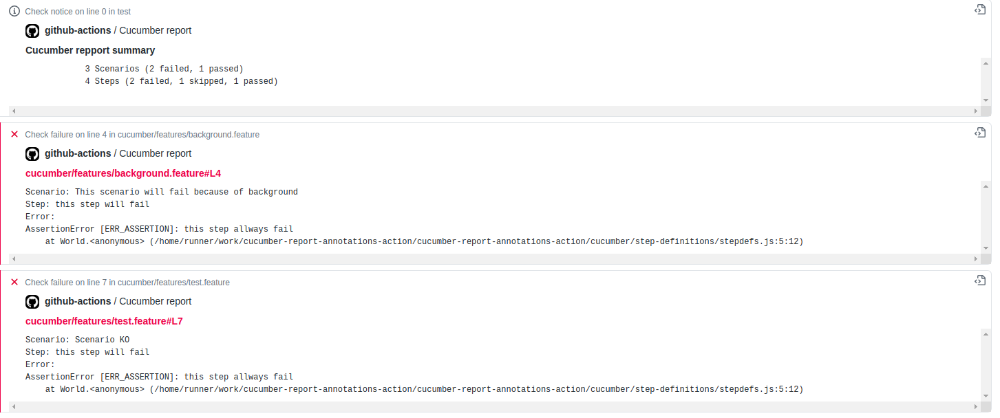

# cucumber-report-annotations-action

This action should be used to publish action annotations from cucumber json report.

## Exemple

``` yml
- uses: deblockt/cucumber-report-annotations-action@v1.5
  with:
    access-token: ${{ secrets.GITHUB_TOKEN }}
    path: "**/cucumber-report.json"
```



## parameters

- **access-token**: mandatory parameter. It's the github token to allow action to add check
- **name** (optional, default: Cucumber report): the check name.
- **path** (optional, default: **/cucumber-report.json): the glob path to get cucumber report on json format
- **check-status-on-error** (optional, default: failure): the check status to use on cucumber error. Can be 'neutral' or 'failure'
- **annotation-status-on-error** (optional, default: failure): the annotation status on error. Can be 'notice', 'warning', 'failure' 